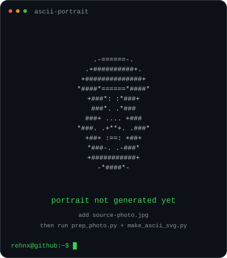

<h3><code>rehnx@github:~$ ./contributions</code></h3>

  

<h3><code>rehnx@github:~$ whoami</code></h3>

<table>
  <tr>
    <td valign="top">
      
    </td>
    <td valign="top">
      
    </td>
  </tr>
</table>

 

<code>rehnx@github:~$ cat selected-work.txt</code>

  

<a href="https://github.com/rehnx/Void-shell"><code>Void Shell</code></a>
&nbsp;·&nbsp;
<a href="https://github.com/rehnx?tab=repositories"><code>all repositories</code></a>
&nbsp;·&nbsp;
<a href="https://rehnx.github.io/My--portfolio/"><code>portfolio</code></a>
&nbsp;·&nbsp;
<a href="https://www.linkedin.com/in/rehan-pathan-aka-zeus"><code>linkedin</code></a>

  

<code>rehnx@github:~$ █</code>

